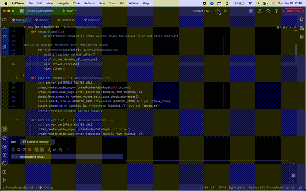

# Full Suite Login Through Checkout 🚀


A professional **end-to-end automation test suite** demonstrating a complete user journey — from **login** through **checkout** — designed for QA portfolios, interview showcases, and scalable automation frameworks.

---

## ✨ Highlights

- **150+ automated tests passing** ✅  
- **End-to-end flow:** Login → Browse → Add to Cart → Checkout  
- **Nested validations:** addresses, company info, cart totals  
- **Dynamic test data** for multiple users/products  
- **Page Object Model (POM)** for maintainable, reusable code  

---

## 📸 Demo Video




---

## 💻 Quick Start

1. **Clone repository**
```bash
git clone https://github.com/michaelrebellon2025-max/Template_for_Full-suite-login-through-checkout.git
cd Template_for_Full-suite-login-through-checkout
````

2. **Create & activate virtual environment, install dependencies**

```bash
python -m venv venv
# macOS/Linux
source venv/bin/activate
# Windows
venv\Scripts\activate
pip install -r requirements.txt
```

3. **Run tests**

```bash
pytest -v
```

* Run a specific test file:

```bash
pytest tests/test_login.py
```

* Run with a specific browser (if configured):

```bash
pytest -v --browser chrome
```

---

## 🛠 Tech Stack

* Python 3.x
* Selenium WebDriver for UI automation
* PyTest for test execution & parameterization
* Optional API validation (if integrated)

---

## ✅ What This Template Validates

* **Login Flow:** Valid/invalid login, error messages, form fields
* **Shopping Cart:** Adding/removing products, quantity updates, cart persistence
* **Checkout:** Address forms, payment entry (mock/test), confirmation page

---

## 📌 Why It Matters

This project demonstrates:

* **Scalable, maintainable test automation**
* **Professional QA practices** suitable for interviews
* **Reusable template** for login, cart, and checkout flows
* **Portfolio-ready evidence** of automation skills

---

## 📈 Future Improvements

* Cross-browser testing (Selenium Grid)
* CI/CD integration (GitHub Actions, Jenkins)
* Visual regression testing
* Integrated API & UI tests
* Advanced test reporting (Allure, HTML)

---

## ❤️ Contributions

Fork, adapt, or enhance this template to fit your QA projects!
